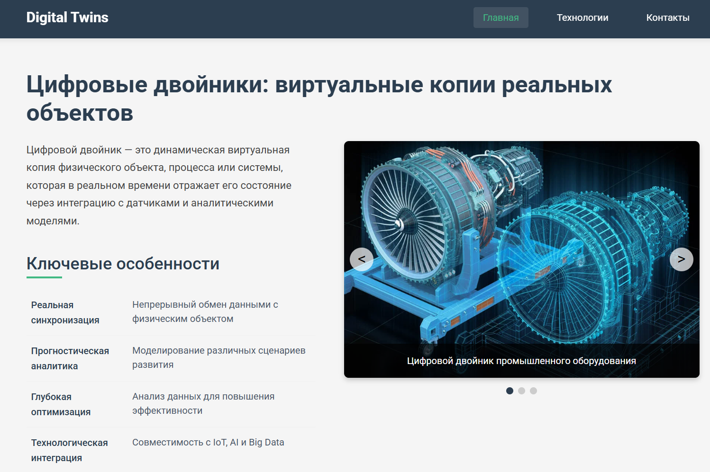

# Digital Twins SPA

Веб-приложение о цифровых двойниках - виртуальных копиях реальных объектов



## Особенности проекта
- Одностраничное приложение (SPA) на Vue.js 3
- Адаптивный дизайн с тремя контрольными точками (1200px, 800px, 550px)
- Интерактивная галерея изображений с ручным переключением
- Подробная информация о технологиях цифровых двойников
- Рабочая контактная форма с валидацией полей
- Модальные окна для отображения статуса отправки формы

## 📂 Структура проекта
```
digital-twins-spa/
├── public/ # Статические файлы
├── src/
│ ├── assets/ # Ресурсы (изображения, стили)
│ ├── components/ # Компоненты Vue
│ │ ├── ContactForm.vue # Форма с валидацией
│ │ ├── GallerySlider.vue # Слайдер изображений
│ │ ├── Header.vue # Навигационное меню
│ │ ├── HomeSection.vue # Основная информация
│ │ ├── Modal.vue # Модальное окно
│ │ └── TechnologiesSection.vue # Раздел технологий
│ ├── App.vue # Корневой компонент
│ └── main.js # Точка входа
├── babel.config.js # Конфигурация Babel
├── package-lock.json # Файл блокировки
└── package.json # Зависимости и скрипты
```

## 🛠 Установка и запуск

1. Установите зависимости:
```bash
npm install
```

2. Запустите сервер разработки:
```bash
npm run serve
```

3. Соберите production-версию:
```bash
npm run build
```

## 📚 Используемые технологии
- Vue.js 3
- SCSS
- Babel
- ESLint
- Vue CLI